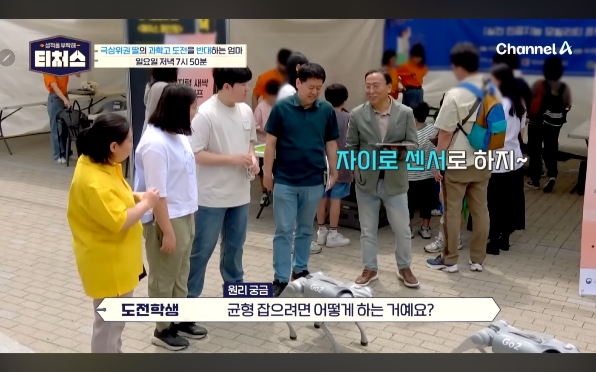

# 황동하를 소개 합니다. 

  1. 안녕하세요 저는 우송대학교에 근무하고 있습니다.        
  2. 아래는 취업을 희망하는 23년 24년 로봇,AI응용 SW 전문가 양성과정의 제자 명단입니다.
     인사 담당자님 들의 많은 관심 부탁 드립니다.
  3. 자소서와 이력서는 요청 하시면 제공해 드리겠습니다.
     회사 고유 양식이 필요 하실때도 별도 요청 해 주시기로 합니다.

## 2024 로봇, AI응용 SW 전문가 양성 과정  
  https://github.com/Emmett6401/2024Member

## 2023 로봇, AI응용 SW 기업맴버쉽 양성 과정
  https://github.com/Emmett6401/2023Member

## 수업 프로젝트 목록 
### it융합학부 
  1. BCCD Detector
     https://github.com/Emmett6401/BCCD-Detect
      이것은 혈액내의 혈소판, 적혈구, 백혈구의 갯수를 판별하는 AI 모델입니다.

     
### 2024년 SW전문가 양성 과정의 프로젝트 목록
  1. 주소록 https://github.com/Emmett6401/addbook_robot
  2. AI Models : 
     * 객체탐지의 모든 것 이론 수업과 YOLO이용하기 : https://github.com/Emmett6401/aiModels/blob/main/_%EA%B0%9D%EC%B2%B4_%ED%83%90%EC%A7%80_(Object_Detection)_YOLO_2024.ipynb
     * 안전모탐지 :
       https://github.com/Emmett6401/aiModels/blob/main/%EC%95%88%EC%A0%84%EB%AA%A8%ED%83%90%EC%A7%80_20240430_robot.ipynb
     * 주차공간탐지 :
       https://github.com/Emmett6401/aiModels/blob/main/PKlot%ED%83%90%EC%A7%80%EB%AA%A8%EB%8D%B8.ipynb
     * 산불탐지 : https://github.com/Emmett6401/aiModels/blob/main/%EC%82%B0%EB%B6%88%EB%B0%A9%EC%A7%80%EB%AA%A8%EB%8D%B8%EB%A7%8C%EB%93%A4%EA%B8%B0.ipynb
     * 포트홀 :https://github.com/Emmett6401/aiModels/blob/main/potHole%ED%83%90%EC%A7%80.ipynb
     * BCCD Detection with Windows PC
https://github.com/Emmett6401/BCCD-Detect
### 2024년 특강 자료 
  1. 당진시_마을 활동가
     https://github.com/Emmett6401/docs_Dangjin/tree/main
### 2024년 이전 프로젝트 
  1. bitmeta 주식, 가상화페 자동매매 https://github.com/Emmett6401/bitMeta
  2. 오디오파일의 Tag 수정 https://github.com/Emmett6401/filename_audiotag
  3. p5.js 프로젝트 참여 https://github.com/Emmett6401/p5test
  4. aBotWeb버젼 ##프로젝트목록 aBotWeb

### 2020년
  1. Vision Python **  https://github.com/Emmett6401/Vision_python **
  2. 티나휴머노이드  https://github.com/Emmett6401/Vision_TiNA
  3. mqtt서버이용휴머노이드제어  https://github.com/Emmett6401/mqtt-poc
  4. node.js를 이용한 서버 구동  https://github.com/Emmett6401/create-serer-with-node.js
  5. mqtt와휴머노이드  https://github.com/Emmett6401/learn-tm-hu18
### ML
  1. 안면인식  https://github.com/Emmett6401/face_recognition
  2. 사물인식  https://github.com/Emmett6401/yoloUI

